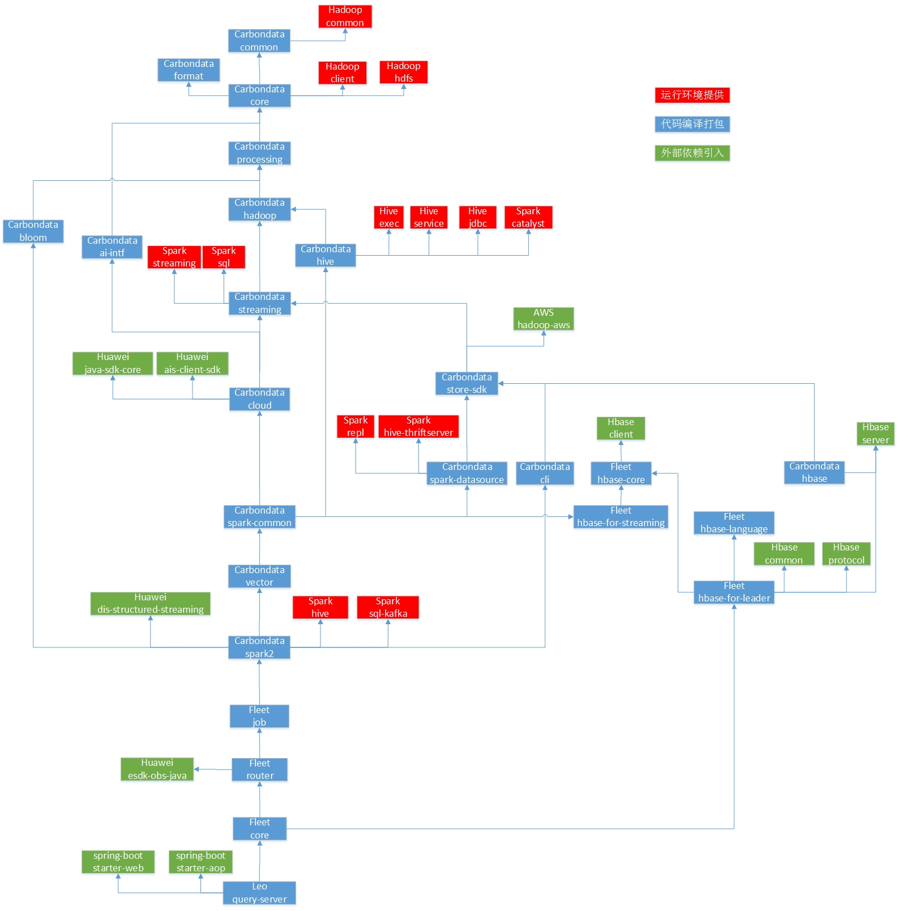

<!--
    Licensed to the Apache Software Foundation (ASF) under one or more
    contributor license agreements.  See the NOTICE file distributed with
    this work for additional information regarding copyright ownership.
    The ASF licenses this file to you under the Apache License, Version 2.0
    (the "License"); you may not use this file except in compliance with
    the License.  You may obtain a copy of the License at

      http://www.apache.org/licenses/LICENSE-2.0

    Unless required by applicable law or agreed to in writing, software
    distributed under the License is distributed on an "AS IS" BASIS,
    WITHOUT WARRANTIES OR CONDITIONS OF ANY KIND, either express or implied.
    See the License for the specific language governing permissions and
    limitations under the License.
-->

## 1. download and use the following settings.xml file
[maven settings.xml](settings.xml)

## 2. build the zip package

### for kernel version(spark 2.3.2.0300, hadoop 3.1.1.0200)

linux build script:
```shell
mvn clean install -Pspark-2.3 -Dspark.version=2.3.2.0300 -Phadoop-3.1 -Dhadoop.version=3.1.1.0200 -DskipTests -Dfindbugs.skip -Dcheckstyle.skip -Dscalastyle.skip=true
```

windows build script:
```shell
mvn clean install -Pwindows -Pspark-2.3 -Dspark.version=2.3.2.0300 -Phadoop-3.1 -Dhadoop.version=3.1.1.0200 -DskipTests -Dfindbugs.skip -Dcheckstyle.skip -Dscalastyle.skip=true
```


### for developer(spark 2.3.2, hadoop 2.8.3)

linux build script:
```shell
mvn clean install -Pspark-2.3 -Dspark.version=2.3.2 -Phadoop-3.1 -Dhadoop.version=3.1.1 -DskipTests -Dfindbugs.skip -Dcheckstyle.skip -Dscalastyle.skip=true
```

windows build script:
```shell
mvn clean install -Pwindows -Pspark-2.3 -Dspark.version=2.3.2 -Phadoop-3.1 -Dhadoop.version=3.1.1 -DskipTests -Dfindbugs.skip -Dcheckstyle.skip -Dscalastyle.skip=true
```

## 3.package path:
LEO_Fleet/fleet/project/target/fleet_2.11-1.6.1.0100.zip

## Note:
The obs sdk 3.0.3 depend on okio-1.14.0.jar, but spark 2.3 depend on okio-1.6.0.jar. 
They are incompatible. To ensure the obs sdk can work fine, it need to remove okio-1.6.0.jar from spark jars.


## 4.module dependency:



